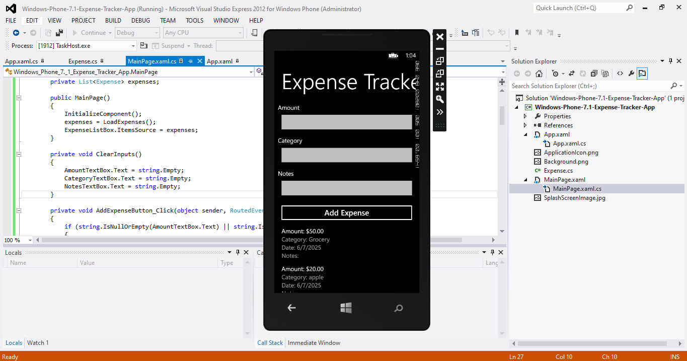

# Windows Phone 7.1 Expense Tracker App  

A simple expense tracking application for Windows Phone 7.1

## Features
- Add expenses with amount, category, and notes
- View expense history
- Data persistence using isolated storage

## Requirements
- Visual Studio 2012 with Windows Phone 7.1 SDK
- .NET Framework 4.0

## Installation
1. Clone this repository
2. Open `Windows-Phone-7.1-Expense-Tracker-App.sln` in Visual Studio
3. Build and deploy to emulator or device

## Screenshots

## License
MIT License - See [LICENSE](LICENSE) file for details